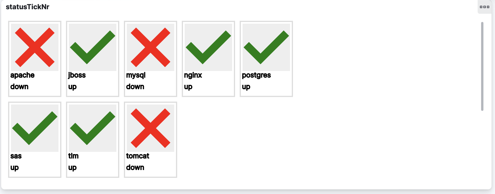

# elastic-updown

`Elastic-updown` contains an elasticsearch/kibana visual, logstash configuration and
a little script to enter some "sample" data into elasticsearch.

## Visual

The visual creates a 5xN grid of status icons showing the availability of
an environment.



To create the visual, open `Visualize library` in Kibana, press `Create
visualization` and select `Custom visualization`. Remove everything in the
right column, copy everything from `visual-statusTickNr.json` into a clipboard
and paste that into the right column. Save the visual and, optionally, add
to a dashboard.

## Python script

A python script (`logstash/msg.py`) is used to create sample data. Use
cron to run this script every 5 minutes.

## logstash

In the `logstash` directory a basic configuration is provided to set up
a logstash service. 

```
logstash
       |-- conf.d
       |   |-- elastic.conf
       |   |-- filters.conf
       |   `-- inputs.conf
       `-- logstash.yml
```

## Sample data

The repository contains a script that adds lines to a log file, which is
in turn scanned by logstash (as in this reposirory) or filebeat.

Each line is JSON-encoded and has the following format:

```json
{
  "clusterenv": "sas",
  "clusterid": "cluster-sas",
  "index": "cluster-status",
  "availability": "up",
  "@timestamp": "2023-05-24T12:36:01+02:00"
}
```

The script also creates `memberStatus` fields, but those aren't necessary
for this visual at the moment.


